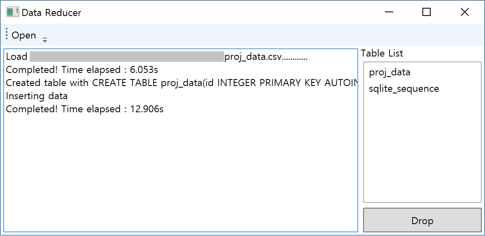

# Abstract & Motivation

해당 프로젝트에서는 Data Reduction Algorithm을 중심으로 해서 몇 가지의 Algorithm과 Graphic Visualization 방식을 선택하여, 데이터 시각화를 보다 빠르고 효율적으로 할 수 있는 Windows Application을 만드는 것을 목표로 한다. 

구체적으로 우리가 설계한 Application의 기능을 한 문장으로 정리하면 다음과 같다. 그 핵심적인 기능은 각 웨이퍼의 센서를 통해서 수집된 수십만 단위의 이상의 빅 데이터를 가져와 Database에 저장하고 그것을 요구에 맞게 불러와 Graph로 그려내는 것이다. 

위 문장에서 요구에 맞게 불러온다는 부분이 중요하다. 우리는 삼성전자 생산기술연구소의 담당자와의 협의를 통해서 스펙을 구체화했고 몇 가지 쟁점에 대해서 정리를 할 수 있었다. 

그 결과로 우리가 목표로 하는 Application에는 단순히 빅 데이터를 저장하고 불러와 시각화하는 것을 넘어서 그 불러오는 데이터의 범위조절 기능, 사용자 편의성을 위한 확대와 축소 기능을 추가로 담기로 하였다.    

결국 이 모든 기능에 있어 가장 큰 쟁점이 되는 것은 다양한 기능보다는 정확히 필요한 기능에 따르는 속도와 정확성이다. 사측의 요구사항은 명백했고 우리는 항상 그 부분에 신경을 써서 생각했다. 

# Introduction

## 과제목표

우리의 Graph Visualization Application은 반도체 생산과정에서 수집된 데이터를 수신하여 각각의 웨이퍼가 어떤 상태인지 확인하기 위한 용도이다. 그렇기 때문에 Visualization 과정에서 반드시 정확성이 요구된다.

관련이 있을 법한 여러 가지 이슈들을 찾아보다가 우리가 발견한 것은 Data Reduction Algorithm이었다. 이것에 주목한 것은 아주 단순한 발상에서부터였다. 바로 그리는 데에 사용하는 데이터가 적다면 빠를 것이라는 점이다. 

또한 쟁점이 되는 것은 Graph Visualization을 수행 했을 때에 나오는 그래프의 패턴이다. 역시 담당자와의 협의를 통해서 알게 된 것으로 실제로 사측에서는 본래 나와야하는 그래프의 패턴과 새로 그려져 나온 그래프의 패턴을 비교하여 웨이퍼의 이상 작동을 찾고 있다 한다. 

이 같은 과정을 통해서 우리는 문제를 정리했다. 그래프는 정확해야 하고 문제가 되는 것은 그 패턴이니 Data Reduction Algorithm을 통해서 수집한 데이터를 가공하여 눈으로 봤을 때 동일한 패턴이 유지되면 되는 것이다. 이것이 확대, 축소 기능을 지원해야 함은 물론이다. 

Algorithm의 효율성에 의해서 실제 수행 시간이 미미하게만 감소하거나 반대로 굉장히 비효율적이라서 오히려 수행 시간이 증가할 수도 있겠지만 적절히만 적용된다면 비약적인 수행 시간 감소가 있을 것은 분명하다. 

## 보고서의 구성

본 보고서는 3장에서 우선 project를 진행하는 데 필요한 배경지식들을 검토한다. 여기에는 주요 개발환경인 .NET framework에 대한 것과, Data Reduction알고리즘, 그리고 database에 대한 내용이 들어갈 것이다. 그 후에, 4장에서는 project에서 요구되는 goal과, 평가항목에 해당하는 요구사항들에 대해서 서술할 것이다. 5장에서는 project의 주요 구조를 개괄하고, 이에 대해서 각 모듈의 상세 구현 specification이 6장의 내용이 될 것이다. 7장에서는 현재 구현이 완료된 부분을 말하고, 8장에서는 앞으로 해야할 것들에 대해서 말하고 9장에서는 학기말 발표에서 어떤 식으로 demo가 이루어질 지 얘기할 것이다. 이후 10, 11장에서 스케쥴 및 일 분담에 대해서 얘기한다. Appendix에서는 6장에 언급된 specification을 하나하나 자세히 살펴볼 것이다.

# Background Study

## Overview

본 project는 서버와 클라이언트 두 개의 application으로 나뉘어있고, 이것은 모두 Windows환경에서 실행된다. 따라서 두 application 모두 .NET Framework를 통하여 작성되었으며, 이 중에서도 Windows Prentation Foundation(WPF) 기반으로 작성되었다. 따라서 WPF framework의 구조와 이에 따른 프로그래밍 패턴에 대한 이해가 필요하다. 또한 project에서 가장 중심이 되는 visualization 성능을 향상시키기 위해서 사용되는 algorithm들을 조사하고 사용될만한 것들을 추려보았다.

## Windows Presentation Foundtation

{#fig:mvvm}

WPF는 .NET framework에서 사용되는 최신의 GUI framework이다. 기존의 WinForms framework와 달리 design(XAML)과 내부 logic(C#)을 구분하여 독립적으로 작성하기 용이하고, 유지관리를 편리하게 할 수 있다. WPF를 사용하는 데에는 MVVM(Model-View-ViewModel) 패턴을 이해하는 것이 필수적이다. MVVM이란 내부 데이터와 로직을 결정하는 Model과, 유저 인터페이스를 디자인하고 이것의 상호관계를 서술하는 View, 그리고 이 사이에서 데이터와 인터페이스를 매핑하는 방법을 서술하는 ViewModel단으로 분리하여 작성하는 패턴이다.

Figure {@fig:mvvm}에서 보듯, ViewModel은 View에 대해 독립적으로 작성되며, 인터페이스와 데이터 간 binding을 통해서 표현방식을 지정해줄 수 있다. 그리고 또한 내부 Model들과 관계를 맺으면서 database에 대한 접근을 시도할 수 있다. 실제 프로그래밍에 있어서 중요한 지점은 View에서는 ViewModel에 쉽게 접근이 가능하지만, ViewModel에서 View의 specific한 요소들을 접근하는 방향은 허용되지 않는다는 것이다.

## Data Reduction Algorithms

Data Reduction Algorithm의 정의는 '숫자나 문자 형식의 디지털 정보를 의미있는 부분만을 남기고 Reduction하는 것'이기 때문에 본 프로젝트의 요구사항을 충족시키기에 가장 적합한 알고리즘이다.   

대표적으로 크게 세 가지 접근을 시도한다. 첫째로 **Strip Algorithm**은 점과 점 사이의 거리를 기반으로 한 알고리즘으로, 두개의 연속된 점을 이은 직선에 대해서 거리가 얼마나 떨어졌는지 여부를 바탕으로 critical point들을 선별한다. 이것은 $O(n)$알고리즘이라는 수행속도상 장점이 있으나, 매개변수를 잡았을 때 reduction의 정도를 가늠하기 어렵다는 단점이 있다.

둘째로 **Visvalingam-Whyatt Algorithm**은 세 점을 이은 면적을 기반으로 한 알고리즘으로, 연속된 세 점을 이은 면적이 가운데 점의 정보량을 나타낸다고 본다. 이에 따라서 모든 점의 정보량을 구하고(각 끝점은 무한대의 정보량을 가짐) 이것이 가장 작은 순서대로 제거하면서 reduction이 이루어진다. 이것은 priority queue를 이용해 $O(n\log n)$으로 구현이 가능하여 약간의 성능 하락이 있지만, Top-k개를 뽑는 method를 제공한다는 점에서 의미가 있다.

셋째로 **Min-max decimation**은 실제로 display에 표시되는 점들의 개수가 그렇게 많을 필요가 없다는 가정에서 출발한다. 즉 x좌표를 pixel단위로 살펴보면, 정수 $x$하나에 대해서 그것이 포함하는 point range에 대한 (시작점, 최대점, 최소점, 끝점)을 잇는 직선들로 표현될 수 있다는 것이다. min과 max를 구하는 것은 역시 $O(n)$에 이루어질 수 있고, 동일한 display를 유지하면서 data reduction을 할 수 있다는 장점이 있다.

## Database Model

Database architecture로 여러 후보들을 검토했다. 일단 우선적으로 가장 많이 사용되는 관계형 데이터베이스 관리시스템(RDBMS)인 MySQL과 더불어 NoSQL기반의 MongoDB, 가볍고 사용하기 간편한 SQLite가 그 후보였다. 우선적으로 MongoDB는 분산처리에 대해서 scalability를 높이려는 database로 알고리즘 자체의 효율성을 요구하는 이 문제에 적합하지 않았다. MySQL은 delete와 update query가 수시로 일어나는 server에 적합한 매우 일반적인 database로, 이러한 concurrency보장에 overhead가 클 것으로 생각되었다. 반대로 SQLite는 한 번에 하나의 application에 대해서만 write가 가능하지만, 이후에 여러 application의 read가 가능한 구조로 되어 있어 해당 project에 더 적합해보였다. 이 Project에서는 insert가 맨 처음 단 1회 이루어지고, 이후 visualize과정에서는 이를 update하는 일은 따로 없기 때문이다. 이러한 점에서 최초의 대형 insert가 이루어지는 것을 빠르고 간편하게 수행하기 위해서 SQLite를 채택하게 되었다.

# Goal & Requirements

프로젝트의 결과물은 평가기준인 속도와 정확성을 담보하면서도, 다중 도식 기능과 확대, 축소 기능을 통해서 더 높은 사용자 경험을 주는 것을 목적으로 한다. 구체적인 요구조건은 다음과 같이 세 개의 세부항목으로 나뉘어 있다.

## 데이터의 구조 및 특성 이해

데이터 시각화를 위한 시스템 및 단계별 입/출력과정을 통한 데이터 처리과정을 구현해야 한다. 또한 이러한 데이터의 특성을 이용한 DB를 구축해서 최적화된 수행 시간을 얻을 것이다. DB 종류나 설계는 자유롭지만, 여러 시도를 통해 최적화된 결과를 얻어내야만 할 것이다.     

## 시각화 기능 구현

테스트 환경(Windows)에서 사용가능한 desktop application을 구현해야 한다. 여기에 있어 사용가능한 기술 중에 충분히 효율적이고 구현에 용이한 것을 나름의 기준으로 채택해야 한다.

또한 Algorithm의 결과를 판단하는 중요 기준으로서 정확성을 삼는다. 그 정확성을 평가하는 데에 있어서 중요한 것은 변곡점의 소실 여부이다. 이들 변곡점이 사소한 것 하나라도 소실된다면 이미 그 Visualization은 실패한 것이다. 

성능 기준은 모든 data를 읽어들여 point를 찍을 때와 비교하여 30%이상 시간을 단축시키는 것이 요구된다.

## 부가기능에 대한 구현

다중 도식 기능과 확대, 축소 기능이 필요하다. 해당 Application은 더 나은 사용자 경험을 위해서 수집된 데이터를 비교할 부분 부분마다 다른 색으로 겹쳐보거나 확대, 축소하는 기능이 필요할 것이다.

## 프로젝트 개발 환경 및 서비스 환경

- 프로젝트 개발 환경
    + OS : Windows 10 64bit
    + Database : SQLite
    + IDE : Visual Studio 2015 Community Edition
    + Language : C# 6.0 + .NET Framework 4.6.1
    + Platform : 2 Desktop Applications with WPF
    + Version Control : gitlab
- 서비스 환경(테스트 환경)
    + OS : Windows 7 64bit
    + CPU : Intel Core i7-4790 3.6GHz
    + RAM : 8G

# Project Architecture

{#fig:arch}

Figure {@fig:arch}에서 보이듯 project 구성은 크게 두 가지 application으로 나뉘어있다. data를 읽어들여 적절한 형태로 database에 저장하는 Server Application과, 이 database를 기초로 user에게 visualization을 제공하는 Desktop application이 그것이다. 양 측 모두 UI interaction이 필요할 뿐 dataflow 자체는 한방향으로 이루어진 단순한 구조를 띠고 있다. 이 둘을 나누어 각각 설명하도록 한다.

## Data Reducer

그림의 Server에 해당하는 것으로, Sensor Data를 파싱하고 data reduction을 수행하며, 이를 database에 넣는 것까지가 그 역할에 해당한다.

### CSV Parsing Module

CSV파일을 읽어 미리 정의된 형식의 data class로 저장시켜주는 module이다. 읽어들인 data는 Data Reduction Module의 input이 된다.

### Data Reduction Module

읽어들인 data에 대해서 각 센서별 데이터에 대해서 차후에 빠르게 visualize할 수 있도록 data reduction을 수행하는 module이다. CSV Parsing Module로부터 data를 받아서 이를 각각의 data reduction module에 넣어주고, 이를 통해서 특정 배율에서 각 point의 포함여부를 받아와 정리하게 된다. 이렇게 분석된 data는 Database Interface Module의 input이 된다.

### Database Interface Module

Database와의 통신을 담당하는 module로, data를 읽어들여 저장할 table의 생성부터, 분석된 data를 insert하는 역할도 맡는다. 이것을 끝으로 Server Application의 역할이 끝나게 된다.

## Data Visualizer

그림의 Desktop Application에 해당하는 것으로, Database에서 자료를 읽어와 Display에 표시하는 것까지를 포괄한다.

### Database Interface Module

Database에서 특정 wafer(table에 해당함)와 sensor의, 특정한 영역에 해당하는 data를 읽어올 수 있도록 interface를 제공하는 module이다. 이를 통해서 application에서 database에 접근하게 된다.

### Cache Controller Module

Display에 표시될 내용이 담긴 cache를 관리한다. 필요할 때에는 Database Interface Module에 요청을 보내 cache를 업데이트하게 된다. 이렇게 업데이트된 data는 Data Interpolator Module을 거쳐 다듬어지고, 이후에 User Display에 업데이트된다.

### Data Interpolator Module

data reduction을 통해서 sparse해진 Series Data의 사이를 추정하여 이어주는 역할을 하는 module이다. Cache Controller의 요청에 응답하는 방식이다.

### User Display

UI View에 해당하는 내용으로, 여기서는 오픈소스 라이브러리인 **OxyPlot**을 사용하여 visualization 및 interface를 제공하였다.

# Implementation Spec

## Data Reducer

{#fig:uir width=60%}

{#fig:clr width=60%}

Figure {@fig:uir}은 Data Reducer의 UI를 보여주고 있다. `Open`버튼으로 입력받을 csv의 경로를 받고, 이것을 UI Thread와 async하게 작업을 하면서 각 단계마다 진행과정을 화면에 찍어주고, 완료 후에는 소요된 시간을 출력한다. csv입력이 들어올 경우 자동으로 parsing, reducing, create table&inserting순서로 data processing을 거치게 된다. 생성된 table은 자동으로 사용자의 application folder(`USER\AppData\Local\LongVis`)에 저장된다.

Figure {@fig:clr}은 이것의 class diagram을 보여준다. Model에 해당하는 `CSVParser`, `Reducer`, `DBInterface`의 순서로 dataflow가 전개될 것이고, 이것을 ModelView에 해당하는 `MainViewModel`이 처리하여 View에 해당하는 `MainWindow`에 출력해 줄 것이다. 상세한 구현 내용은 Appendix A에서 서술하도록 한다.

## Data Visualizer

{#fig:uiv width=60%}

{#fig:clv width=60%}

Figure {@fig:uiv}은 Data Visualizer의 UI를 보여주고 있다. `Open`을 누르면 현재 Database에 저장되어 있는 table의 목록이 나오고, 이를 선택하면 해당 Database에서 point를 불러와 visualize하게 된다.

Figure {@fig:clv}은 이것의 class diagram을 보여준다. Model에 해당하는 `CacheController`에서는 `DBInterface`를 통해 Data를 가져오게 되고, ModelView의 `MainViewModel`에서 이를 interface에 맞게 cache update를 수행하며, View에 해당하는 `MainWindow`에 출력하게 된다. 상세한 구현 내용은 Appendix A에서 서술하도록 한다.

## Database Structure

{#fig:db width=60%}

Sensor Data는 `timestamp`와 `S_1`, `S_2`, $\cdots$의 형태로 들어오는 double형의 센서별 value로 이루어져 있다. 이것을 일단 따로 나누지 않고 그대로 저장하되, Data Reduction의 결과를 저장하는 column을 새로 만들어 추가한다. 그런데 각 확대 배율마다 새로운 column을 만드는 것은 data table의 크기를 불필요하게 늘리는 것이기 때문에, 하나의 integer 속에 bitmask의 형태로 각 센서별 **mask column**에 저장하게 된다. 이렇게 되면 32-bit integer를 사용할 경우 최대 32개의 배율 preset을 표현할 수 있게 된다. 특정 배율에서부터 해당 Point를 그려줘야 하는 시점에 1을 넣는 식으로 표현된다. 물론 가장 확대를 크게 했을 때는 모든 점들이 포함되어야 하므로, 모든 **mask column**의 값은 0보다 클 것이다. 즉, 최소 한 bit는 1로 설정되어 있을 것이다.

이것은 확대/축소를 통해서 데이터를 얻을 때 효율적인 방식이다. 가장 축소된 배율의 단위를 최상위 bit로 놓으면, 특정 배율 `m`($2^n$의 형태)에서 얻어올 point의 쿼리는 `Mask >= m`의 형태가 된다. 이런 식의 ordering이 성립하기 때문에 미리 indexing이 가능하고 좀 더 빠르게 확대/축소의 operation을 실행할 수 있게 된다.

## Used Libraries

- **CSVHelper** : CSV파일 parsing에 사용
- **OxyPlot** : WPF에 맞는 Graph Control제공

# Current Status

- Data Reducer의 기본 기능 구현
    + CSV Parsing
    + Data Reduction
    + Database Insert
- Data Visualizer의 기본 기능 구현
    + Loading Data from Database
    + Data Visualization
    + 현재 모든 점을 찍는 데 걸리는 시간은 약 5초 정도 소요됨 : 30% 단축시 3.5초
- Database구조 및 확대/축소 알고리즘 구상

# Future Work

- 다중 Sensor의 Visualization을 위한 UI개선
    + 각 Sensor의 visibility 설정
    + 각 Sensor의 display 조절
    + 두 Sensor를 각기 다른 y축에 올려놓기
- 확대 및 축소 기능
    + Cache구조의 구현
- 각종 최적화 및 추가 기능 구현
    + `IEnumerable` type을 이용한 stream처리
    + Change-Point Detection

\clearpage

# Division & Assignment of Work

{#fig:ass width=70%}

# Schedule

{#fig:sch width=70%}

# Demo Plan

{#fig:demo width=70%}

Demo방식은 대용량 CSV파일을 읽어들여 이를 Visualize하는 일련의 과정을 시연하게 될 것이다. 이 과정에서 기존 방법과의 대조를 보이기 위해, 각각 다른 버젼의 program을 같은 data에 대해서 수행하여 속도 차이를 보일 것이다. 또한 기존의 모든 점을 찍는 방식과 결과물을 비교하여 정확성에도 차이가 없음을 보이는 것이 목표이다. 이에 더해서 추가 UI기능들(Zoom, Pan)도 함께 시연한다.

이를 위해서 각각의 process를 실행시키고, 같은 데이터를 불러와 같은 operation을 수행하여, 각각에 걸리는 시간과 결과값이 얼마나 차이가 생기는지를 보이는 Tester를 구현하여 시연하는 것이 바람직할 것이다.

\appendix
\section{(Appendix) Detailed Implementation Spec} \label{App:AppendixA}

## Data Reducer

### `CSVPaser` Class

- Properties
    + `public string[] headers { get; set; }`
        * csv로 읽어들인 데이터의 column정보를 담는 배열이다.
    + `public Dictionary<string, List<double>> raw { get; set; }`
        * csv로 읽어들인 데이터를 하는 dictionary로, `raw["S_1"]`과 같이 사용하여 해당 데이터의 배열을 접근할 수 있다.
    + `public int raw_len { get; set; }`
        * csv로 읽어들인 데이터의 raw size를 의미한다.
- Methods
    + `public CSVParser()`
        * 생성자로, 별다른 역할을 하지 않는다.
    + `public void Open(string path)`
        * `path`에 해당하는 csv파일을 읽어들여 `raw`에 저장한다.

### `Reducer` Class

- Methods
    + `static double calcDb(double dx, double dy, double dtx, double dty, double r)`
        * Line Strip Algorithm에 사용되는 helper function
    + `static double calcRb(double dx, double dy, double dtx, double dty, double r, double Db)` 
        * Line Strip Algorithm에 사용되는 helper function
    + `static double getAreaOfTriangle(double ax, double ay, double bx, double by, double cx, double cy)`
        * Visvalingam-Whyatt Algorithm에 사용되는 helper function
    + `static List<int> reduce_RnW(ref List<double> px, ref List<double> py, double[] tolerance)` 
        * x의 값들을 담은 `px`와 대응하는 y의 값들을 담은 `py`에 대하여 `tolerance`들을 매개변수로 Line Strip Algorithm을 수행하여 bitmask의 리스트로 리턴
    + `static List<int> reduce_VnW(ref List<double> px, ref List<double> py, int[] threshold)`
        * x의 값들을 담은 `px`와 대응하는 y의 값들을 담은 `py`에 대하여 `threshold`들을 매개변수로 Visvalingam-Whyatt Algorithm을 수행하여 bitmask의 리스트로 리턴
    + `static List<int> reduce_MnM(ref List<double> px, ref List<double> py, int[] blocks)`
        * x의 값들을 담은 `px`와 대응하는 y의 값들을 담은 `py`에 대하여 `blocks`들을 매개변수로 Min-max Algorithm을 수행하여 bitmask의 리스트로 리턴

### `DBInterface` Class

- Fields
    + `private SQLiteConnection conn`
        * SQLite와의 connection을 담당하는 변수
- Methods
    + `public string CreateTable(string name, CSVParser csv)`
        * `name`이라는 이름의 Table을 `csv`의 column에 해당하는 형태로 만들어준다
    + `public DBInterface()` 
        * 생성자. SQLite와의 connection 초기화.
    + `public void execute(string q)` 
        * 리턴값이 없는 쿼리 `q`를 수행함
    + `public DataTable GetDataTable(string q)` 
        * 리턴값이 존재하는 쿼리 `q`를 읽어 `DataTable`형태로 리턴
    + `public List<string> tables()` 
        * 해당 Database에 존재하는 table list를 불러옴
    + `public void insert(string name, CSVParser csv)`
        * `name` table에 대해서 `csv`가 가진 raw data들을 insert함

### `Env` Class

- Properties
    + `public static string app` 
        * `USER\AppData\Local`에 대한 위치를 생성시에 얻어온다
    + `public static string root`
        * `USER\AppData\Local\LongVis`에 대한 위치를 얻어온다
    + `public static string dbpath`
        * `USER\AppData\Local\LongVis`에 담긴 db file의 위치를 얻어온다

### `MainViewModel` Class

- Properties
    + `public string Logger`
        * View의 TextBox와 binding되어 있는 속성으로, 중간과정들을 표시해주는 역할
    + `public ObservableCollection<string> Tables`
        * View의 ListBox와 binding되어 있는 속성으로, 현재 생성된 table의 list를 표시해주는 역할
- Methods
    + `public void Log_begin(string s, bool t = true)`
        * `s`라는 작업을 시작다는 log를 보냄. `t`가 false인 경우에 따로 이를 업데이트하지 않음
    + `public void Log_update()`
        * 기존의 log에 `.`을 찍어 계산중임을 나타냄
    + `public void Log_end()`
        * 기존의 작업을 끝내는 log를 보냄. `Log_begin`으로부터의 시간을 측정하여 같이 표시해준다.
    + `public MainViewModel()`
        * 생성자로 각종 변수 및 timer를 초기화한다.

### `MainWindow` Class

- Methods
    + `private void Button_Click(object sender, RoutedEventArgs e)`
        * 유일한 버튼인 table drop버튼의 click이벤트로, ListBox에서 선택되어 있는 table을 drop한다
    + `private void csv_open(string path, string name)`
        * 해당 `path`에 있는 csv파일을 `name`이라는 table을 생성하여 옮기는 작업을 총괄하는 함수. UI Thread와 Async하게 수행된다.
    + `private void Open_Executed(object sender, ExecutedRoutedEventArgs e)`
        * `Open`단추를 클릭했을 때 발생하는 이벤트로, 파일 대화상자를 열고 `csv_open`을 Async하게 수행한다.
    + `public void Table_reload(IAsyncResult res = null)`
        * Table List를 다시 읽어들이는 함수

## Data Visualizer

### `DBInterface` Class

- Methods
    + `public DBInterface()` 
        * 생성자. SQLite와의 connection 초기화.
    + `public void execute(string q)` 
        * 리턴값이 없는 쿼리 `q`를 수행함
    + `public DataTable GetDataTable(string q)` 
        * 리턴값이 존재하는 쿼리 `q`를 읽어 `DataTable`형태로 리턴
    + `public List<string> tables()` 
        * 해당 Database에 존재하는 table list를 불러옴

### `CacheController` Class

- Properties
    + `public List<LineSeries> line { get; set; }`
        * `LineSeries`의 형태로 저장한 Cache로, `Plot`에서 이를 등록해 사용할 수 있다.
- Methods
    + `public void fill_data(int l, int r, int width`
        * [`l`, `r`) 구간 내의 data를 `width`라는 픽셀 안에 표현한다는 정보를 전해서 이에 알맞는 region의 table을 불러온다.
    + `public void open_table(string name)`
        * 맨 처음 시작시에 table을 열어주는 함수.

### `MainViewModel` Class

- Properties
    + `public string Logger`
        * View의 StatusBar와 binding되어 있는 속성으로, 중간과정들을 표시해주는 역할
    + `public PlotModel Plot { get; set; }`
        * View의 OxyPlot Control에 binding되어 있는 속성으로, ViewModel에서 이를 통제하는 수단으로 기능한다
- Methods
    + `public void Log_begin(string s, bool t = true)`
        * `s`라는 작업을 시작다는 log를 보냄. `t`가 false인 경우에 따로 이를 업데이트하지 않음
    + `public void Log_update()`
        * 기존의 log에 `.`을 찍어 계산중임을 나타냄
    + `public void Log_end()`
        * 기존의 작업을 끝내는 log를 보냄. `Log_begin`으로부터의 시간을 측정하여 같이 표시해준다.
    + `public MainViewModel()`
        * 생성자로 각종 변수 및 timer를 초기화한다.
    + `public void Open_clicked(string name)`
        * `name`이라는 table을 Open하는 command와 binding된 함수로, `cache_update` UI Thread와 Async하게 호출해준다.
    + `public void cache_update(string name)`
        * `cache_update`가 수행되는 경우는 총 두가지로, 맨 처음 Open버튼이 클릭된 경우와, 인터페이스 조정에 따라서 cache를 업데이트할 필요성이 생길 때이다. `CacheController`에 대한 조작을 통해서 알맞은 cache region으로 업데이트한다.

### `Env` Class

- Properties
    + `public static string app` 
        * `USER\AppData\Local`에 대한 위치를 생성시에 얻어온다
    + `public static string root`
        * `USER\AppData\Local\LongVis`에 대한 위치를 얻어온다
    + `public static string dbpath`
        * `USER\AppData\Local\LongVis`에 담긴 db file의 위치를 얻어온다

### `MainWindow` Class

- View에 해당하는 Class로 생성자에서 Window를 초기화한다.